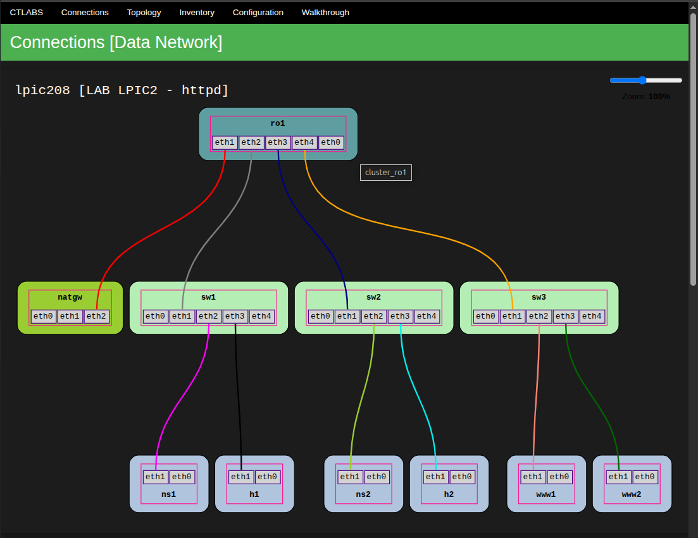

# ctlabs

ctlabs is a tool designed to streamline the creation of repeatable lab environments.
It automates the setup and configuration of lab components, which are all run as containers. When full virtualization is required, ctlabs creates QEMU instances within those containers and connects them to the container's network via TAP interfaces. This approach allows for a consistent and straightforward lab setup, regardless of the virtualization needs.

**Key Features:**

* Automated lab setup using YAML configuration files.
* Support for virtual machines (using QEMU/KVM) and containers (using Podman).
* Integration with Ansible for configuration management.
* Flexibility to define custom lab topologies and configurations.
* Automatic creation of segregated Data and Management Networks for enhanced lab isolation.
* Each node is equipped with a dedicated management interface and one or more data network interfaces.

**Use Cases:**

* Preparing for Linux certifications (LPIC, RHCSA).
* Testing network configurations and protocols.
* Learning specific technologies like Kubernetes or Docker.
* Creating isolated environments for software development and testing.
* Simulating complex network scenarios with distinct Data and Management Networks.
* ...

## Manual Installation

### Prerequisites

* CentOS 9
* enabled nested virtualisation

**System Dependencies:**

```bash
sh# dnf install git ruby graphviz ipvsadm make podman-docker qemu-img cloud-utils-growpart python3-pip tmux vim
sh# gem install webrick sinatra rackup
```

_optional_
```bash
sh# dnf install epel-release htop irb wireshark-cli tcpdump perf bpftrace kernel-modules-extra-$(uname -r)
```

## Automated Installation

For faster and more consistent setup, you can use Terraform to automate the creation of a CentOS 9 virtual machine.
* [Terraform configuration](https://github.com/oxdeca/ctlabs-terraform/tree/main/01_lpic2/gcp): 
	* This Terraform configuration creates a CentOS 9 VM on Google Cloud Platform.
* [Installation shell script](https://github.com/oxdeca/ctlabs-terraform/blob/main/01_lpic2/ppvm.sh): 
	* This shell script installs all the necessary packages and dependencies on the VM. (used by the terraform code)

## Container Images

ctlabs relies on a set of pre-built container images for various lab components. 
The make command in the images directory builds the necessary container images using Podman.
This process may take some time.

```bash
git clone https://github.com/oxdeca/ctlabs
cd ctlabs/images && make
cd -
```

## Using ctlabs

Clone the `ctlabs-ansible` repository which contains all the ansible playbooks/roles that are used to setup lab environments.

```bash
git clone https://github.com/oxdeca/ctlabs-ansible
```

**Run ctlabs:**

This command uses the `ctlabs.rb` script to create a lab environment defined in the `lpic208.yml` file.

```bash
cd ctlabs/ctlabs
./ctlabs.rb -c ../labs/lpic2/lpic208.yml -up
```


## Network Configuration:

ctlabs automatically creates separate Data and Management Networks when starting a lab, enhancing lab isolation.

  * **Management Network:**
      * Nodes with `type: controller` or `kind: mgmt` are placed in the Management Network.
      * This network is used for lab management tasks, e.g. ansible controller.
      * Management network links are automatically generated by ctlabs.
      * Each node has a management interface connected to this network, that is isolated from the data network via a VRF.

  * **Data Network:**
      * This network simulates the primary data communication within the lab.
      * Data network links are defined within the lab's YAML configuration.
      * Each node can have multiple data network interfaces.

## `server.rb`

The included `server.rb` app provides a simple overview of the lab, i.e.

* visual representations
* configuration
* management network inventory

### Installation

The `server.rb` app can be installed as systemd service by simply copying the provided unit file and reloading systemd.

```bash
cd ctlabs/ctlabs
cp ctlabs-server.service /etc/systemd/system/ctlabs-server.service
systemctl daemon-reload
systemctl enable --now ctlabs-server.service
```

By default the interface can be accessed via `https://<your_host>:4567`.


