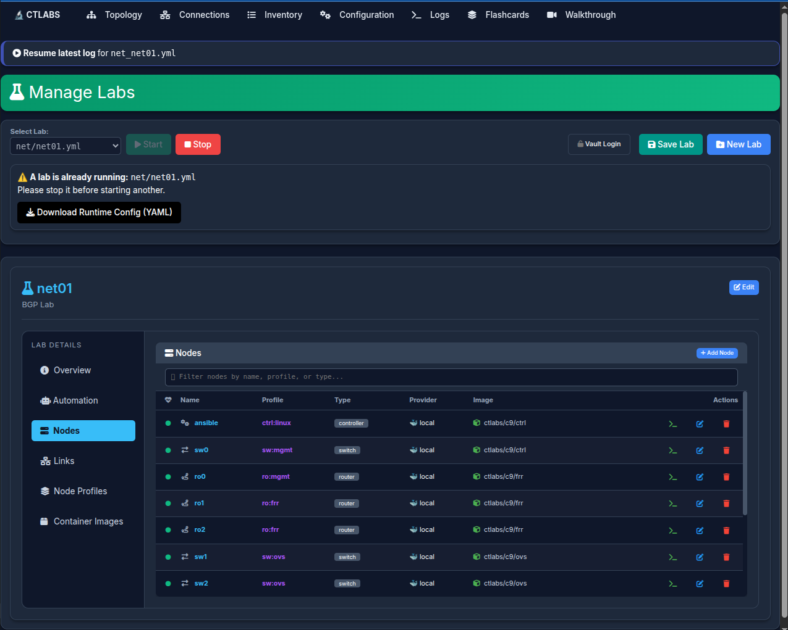

CtLabs
======

`ctlabs` is a tool designed to streamline the creation of repeatable lab environments.
It automates the setup and configuration of lab components, which are all run as containers. When full virtualization is required, ctlabs creates QEMU instances within those containers and connects them to the container's network via TAP interfaces. This approach allows for a consistent and straightforward lab setup, regardless of the virtualization needs.

 


Key Features
------------

* **Automated Lab Setup:** Uses YAML configuration files to define complex environments.
* **Hybrid Virtualization:** Support for virtual machines (using QEMU/KVM) and containers (using Podman).
* **Infrastructure as Code:** Integrated editors for Ansible playbooks, Terraform configurations, and Dockerfiles.
* **Segregated Networking:** Automatic creation of isolated Data and Management Networks for enhanced lab security and realism.
* **Real-time Visibility:** Unified logging architecture with real-time streaming in both CLI and web interfaces.
* **Interactive Web Terminal:** Integrated xterm.js-based console access for every node in the lab.
* **Dynamic Topology Mapping:** Automated SVG generation for both Data and Management network planes.
* **Ad-hoc DNAT Management:** Runtime port forwarding with a full audit trail visible in operational logs.
* **Concurrency Protection:** Playbook execution lock prevents dangerous concurrent runs between CLI and web interfaces.


Installation
----------------------

### CentOS

- Tested successfully with CentOS 9
- enabled nested virtualisation

```sh
curl -fSs https://raw.githubusercontent.com/oxdeca/ctlabs/refs/heads/main/install.sh | bash
```


Manual Installation
-------------------

### Prerequisites

* CentOS 9
* enabled nested virtualisation

**System Dependencies:**

```bash
sh# dnf install git ruby graphviz ipvsadm make podman-docker qemu-img cloud-utils-growpart python3-pip tmux vim ruby-devel gcc make redhat-rpm-config
sh# gem install webrick sinatra rackup faye-websocket puma
```

_optional_
```bash
sh# dnf install epel-release htop irb wireshark-cli tcpdump perf bpftrace kernel-modules-extra-$(uname -r)
```

Container Images
----------------

ctlabs relies on a set of pre-built container images for various lab components. 
The make command in the images directory builds the necessary container images using Podman.
This process may take some time.

```bash
git clone https://github.com/oxdeca/ctlabs
cd ctlabs/images && make
cd -
```

Using ctlabs
------------

Clone the `ctlabs-ansible` and `ctlabs-terraform` repositories which contains all the ansible playbooks/roles and terraform modules that are used to setup lab environments.

```bash
git clone https://github.com/oxdeca/ctlabs-ansible
git clone https://github.com/oxdeca/ctlabs-terraform
```

**Run ctlabs:**

This command uses the `ctlabs.rb` script to create a lab environment defined in the `lpic208.yml` file.

```bash
cd ctlabs/ctlabs
./ctlabs.rb 
Usage: ctlabs [options]
    -c, --conf=CFG                   Configuration File
    -u, --up                         Start the Environment
    -d, --down                       Stop the Environment
    -g, --graph                      Create a graphviz dot export file
    -i, --ini                        Create an inventory ini-file
    -t, --print                      Print inspect output
    -p, --play [CMD]                 Run playbook
    -l, --list                       List all available labs
    -L, --log-level=LEVEL            Set the log level
    -s, --status                     Show status of currently running lab
```

Web Interface (`server.rb`)
---------------------------

The web interface provides a comprehensive management console for your labs.

### Lab Details View


The Lab Details view is the central hub for managing a specific lab environment. It is organized into several functional tabs:

* __Overview__: Displays lab metadata (name, description) and a real-time table of **Exposed Ports (DNAT)**. It includes a form to add **Ad-hoc DNAT Rules** during runtime.
* __Automation__: Integrated editors for managing **Ansible playbooks**, **Terraform scripts**, and **Dockerfiles** associated with the lab.
* __Nodes__: A complete list of all nodes (VMs and Containers). Shows hardware specs (CPU, RAM), images, and provides quick actions for terminal access or editing.
* __Links__: Visual and form-based management of network connections between nodes and virtual switches.
* __Node Profiles__: Management of reusable templates for node configurations, allowing for consistent deployment of common node types.
* __Container Images__: View and manage the local container images available for use within the lab.

---

### Modals & Editors

The UI employs various modals to provide focused editing experiences:

* **Node Editor**: Configure hardware resources, network interfaces, and startup images for individual nodes.
* **Link Editor**: Define connections, VLANs, and interface mappings between lab components.
* **Automation Editors**: Full-screen CodeMirror editors for Ansible, Terraform, and Dockerfiles with syntax highlighting.
* **Container Image Manager**: Tools to pull new images or create custom ones via Dockerfiles.
* **Vault Login**: Securely manage credentials for integrated services.

### Network Topologies

ctlabs provides automated, real-time visualization of your lab's network structure:

*   **Data Network Topology**: Visualizes the primary communication paths defined in your lab configuration.
*   **Management Network Topology**: Shows the isolated management plane, including the controller and management interfaces of all nodes.
*   **Interactive Viewer**: SVG-based maps with pan and zoom capabilities for exploring complex topologies.


### Ansible Inventories

Inventories are dynamically generated based on the current lab state:

*   **Management Inventory**: Targets the `eth0` interface on the isolated management plane. Used for initial provisioning and out-of-band management.
*   **Data Inventory**: Targets the data plane interfaces (`eth1`, etc.). Used for configuring services that run over the simulated lab network.

### Connections & Terminals

Every node in the lab is accessible via an integrated web terminal:

*   **WebSocket Powered**: Uses WebSockets for low-latency, bi-directional communication.
*   **Xterm.js**: A full-featured terminal emulator in your browser, supporting copy-paste, resizing, and standard ANSI sequences.
*   **Direct Console Access**: Connect directly to the shell of Podman containers. QEMU serial console is accesible via tmux session in the container.


---

Network Architecture
--------------------

ctlabs automatically creates separate network planes to enhance lab isolation and simulate complex environments.

  * **Management Plane (mgmt):**
      * Used for out-of-band management tasks, such as initial provisioning via the Ansible controller.
      * Nodes with `type: controller` or explicitly assigned to the `mgmt` plane are placed here.
      * ctlabs automatically generates management links for all local nodes, isolated from other networks via a VRF.

  * **Data Plane (data):**
      * Simulates the primary communication network within the lab.
      * Links and interface mappings are defined within the lab's YAML configuration.
      * Most simulated services and user traffic run over this plane.

  * **Transit Plane (transit):**
      * Dedicated to carrying traffic between different network segments or remote sites.
      * Frequently used for VPN gateways (OpenVPN, WireGuard) and overlay network tunnels.
      * Isolated from management traffic to ensure realistic routing scenarios.

  * **Edge Plane (edge):**
      * Represents the boundary between the internal lab infrastructure and external networks (e.g., the public Internet).
      * Used for nodes requiring NAT, public IPs, or providing external access points.
      * Often serves as the termination point for cloud-integrated nodes (GCP, AWS).

Installation as a Service
-------------------------

The `server.rb` app can be installed as systemd service by simply copying the provided unit file and reloading systemd.

```bash
cd ctlabs/ctlabs
cp ctlabs-server.service /etc/systemd/system/ctlabs-server.service
systemctl daemon-reload
systemctl enable --now ctlabs-server.service
```

By default the interface can be accessed via `https://<your_host>:4567`.



