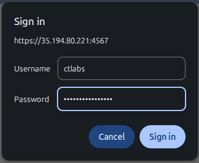
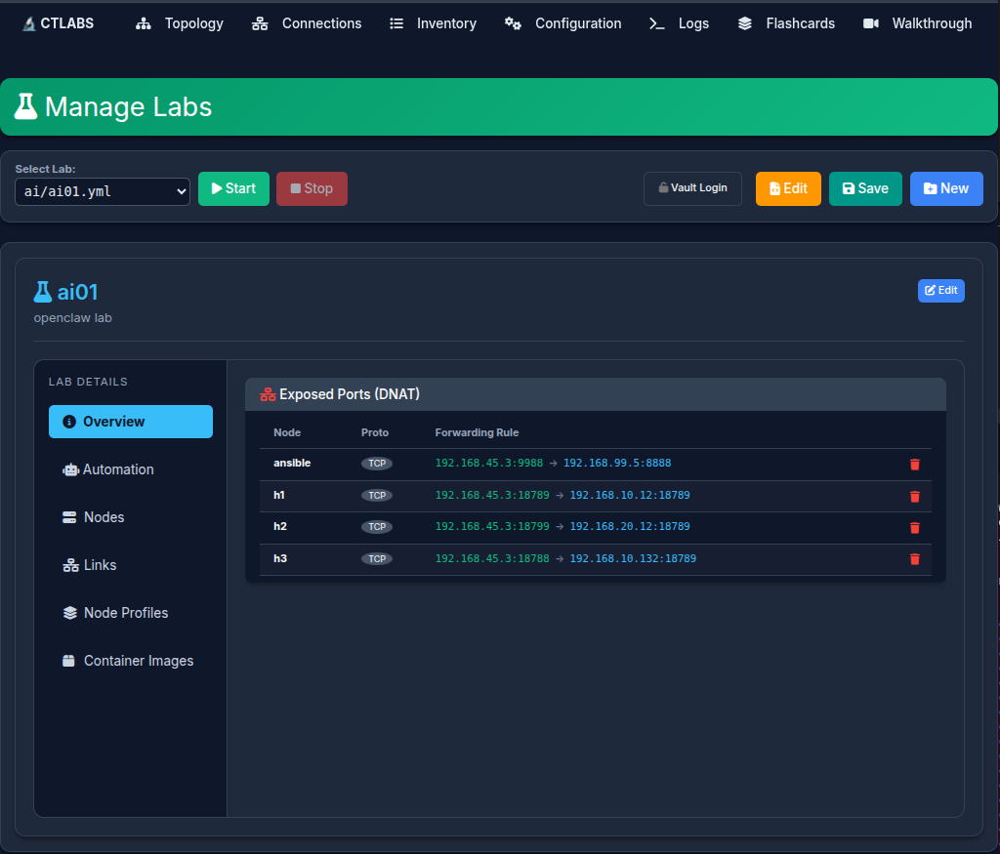
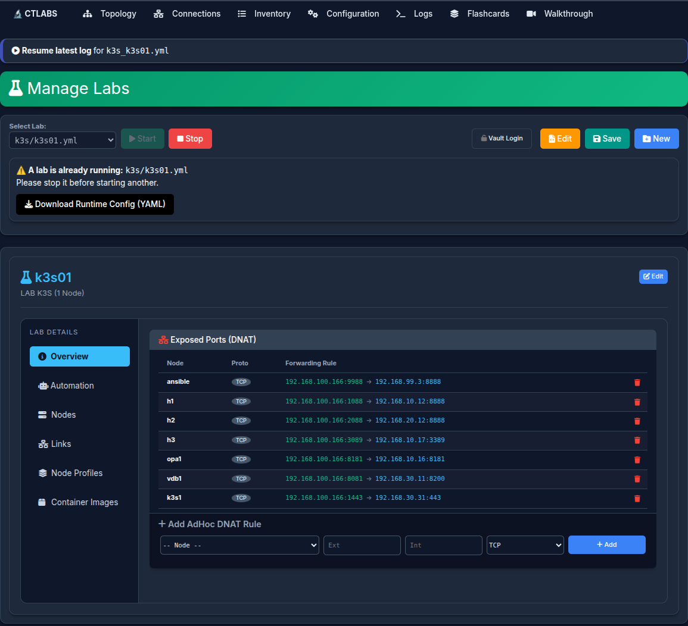
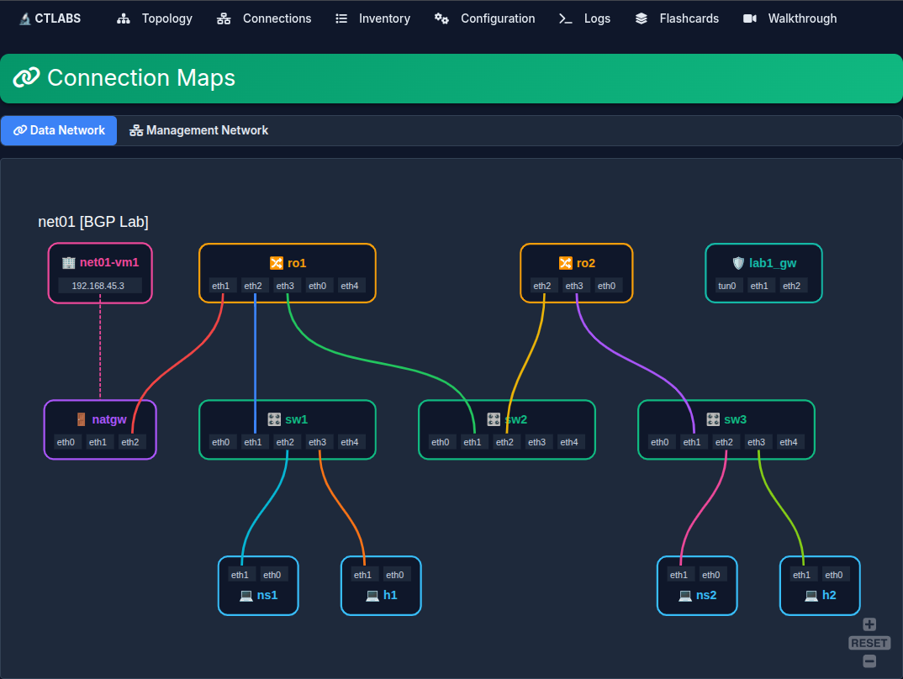
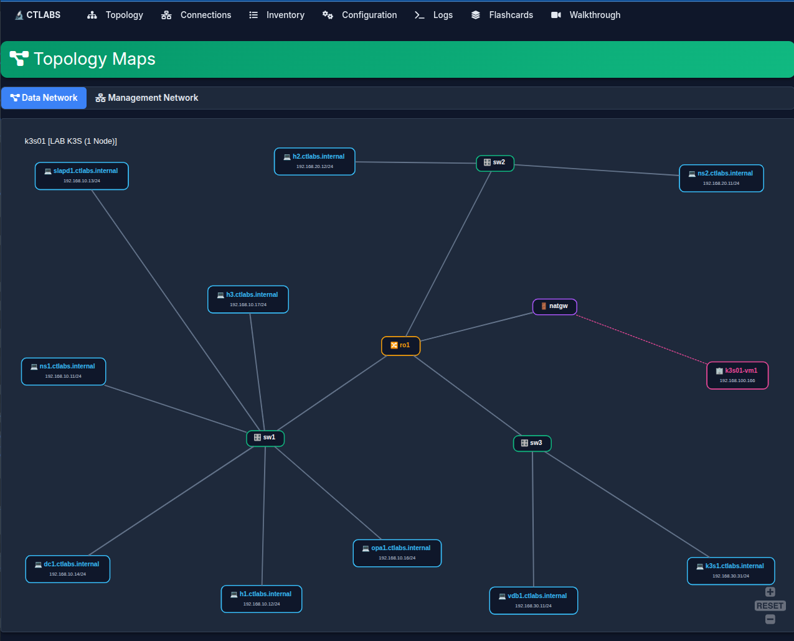
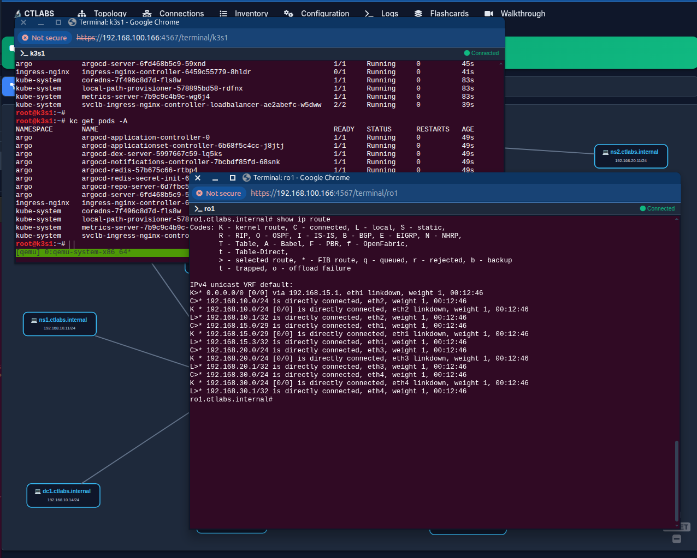

CTLABS
======

`ctlabs` is a tool designed to create temporary lab environments using KVM that can be used as a playground for experimentations, testing, development, study ...
It automates the setup and configuration of lab components, which are primarily run as containers. When full virtualization is required, QEMU instances can be created within containers. The QEMU instances are then connected via TAP interfaces to the container network. The environment is extensiable, e.g. more KVM instances can be added. Those can be located anywhere as long as they have network connectivity. This approach allows for a consistent, straightforward and flexible lab setup, regardless of the virtualization needs.

 


Key Features
------------

* **Automated Lab Setup:** Uses YAML configuration files to define complex environments.
* **Hybrid Virtualization:** Support for virtual machines (using QEMU/KVM) and containers (using Podman).
* **Infrastructure as Code:** Integrated editors for Ansible playbooks, Terraform configurations, and Dockerfiles.
* **Segregated Networking:** Automatic creation of isolated Data and Management Networks for enhanced lab security and realism.
* **Real-time Visibility:** Unified logging architecture with real-time streaming in both CLI and web interfaces.
* **Interactive Web Terminal:** Integrated xterm.js-based console access for every node in the lab.
* **Dynamic Topology Mapping:** Automated SVG generation for both Data and Management network planes.
* **Ad-hoc DNAT Management:** Runtime port forwarding with a full audit trail visible in operational logs.
* **Concurrency Protection:** Playbook execution lock prevents dangerous concurrent runs between CLI and web interfaces.
* **CLI and WebUI** Can be used via cli and WebUI

Installation
------------

1. Create a new or use an existing VM that runs centos9/10. 
2. Make sure `nested virtualization` is enabled.

_VM with enabled `nested virtualiztion`_
```
root@vm1:~# grep -cw vmx /proc/cpuinfo  # if "result > 0" nested virtualzation is supported.
4
```

The VM should have at least following resources:

| vCPUs | Memory | Storage |
|------|---------|---------|
|   2  |   4GB   |   20GB  |

e.g. we can create a vm in `GCP` using machine-type `n1-standard-1` (2 vCPU, 4GB RAM):

```bash
gcloud compute instances create vm1    \
    --zone=us-central1-a               \
    --machine-type=n1-standard-1       \
    --image-family=centos-stream-9     \
    --image-project=centos-cloud       \
    --boot-disk-size=20GB              \
    --enable-nested-virtualization     \
    --provisioning-model=SPOT          \
    --instance-termination-action=STOP \
    --max-run-duration=8h
```

3. Login into the vm and run the `install.sh` script

```sh
curl -fSs https://raw.githubusercontent.com/oxdeca/ctlabs/refs/heads/main/install/install.sh | bash
```


```bash
[root@vm1 ~]# curl -fSs https://raw.githubusercontent.com/oxdeca/ctlabs/refs/heads/main/install/install.sh | bash
Starting CT Labs Deployment...
Configuring SELinux...                             [  OK  ]
Configuring system...                              [  OK  ]
Configuring tmux...                                [  OK  ]
Disable mandb...                                   [  OK  ]
Updating OS...                                     [  OK  ]
Autoload kernel modules...                         [  OK  ]
Installing packages...                             [  OK  ]
Configuring services...                            [  OK  ]
Cloning repositories...                            [  OK  ]
Building container images (background)...          [  OK  ]
Performing final status checks...
Waiting for ctlabs-server to start.... UP

=============================================================================
CTLABS DEPLOYMENT SUCCESSFUL
=============================================================================
Web UI is ready at: https://192.168.45.3:4567
Default user      : ctlabs
Password          : sycSH/8kl4pMzopV

Note: Container images are being built in the background.
=============================================================================
```

3. Login into the `WebUI` with the information given in the summary:



> If the VM is only accessible via `NAT` we need to replace the private ip with the public one.





---


Web Interface
-------------

The web interface provides a management console for our labs.

### Lab Details View


The Lab Details view is the central hub for managing a specific lab environment. It is organized into several functional tabs:

* **Overview:**
  * Displays lab metadata (name, description) and a real-time table of **Exposed Ports (DNAT)**. It includes a form to add **Ad-hoc DNAT Rules** during runtime.

* **Automation:**
  * Integrated editors for managing **Ansible playbooks**, **Terraform scripts**, and **Dockerfiles** associated with the lab.

* **Nodes:**
  * A complete list of all nodes (VMs and Containers). Shows hardware specs (CPU, RAM), images, and provides quick actions for terminal access or editing.

* **Links:**
  * Visual and form-based management of network connections between nodes and virtual switches.

* **Node Profiles:**
  * Management of reusable templates for node configurations, allowing for consistent deployment of common node types.

* **Container Images:**
  * View and manage the local container images available for use within the lab.

---

Network Architecture
--------------------

ctlabs automatically creates separate network planes to enhance lab isolation and simulate complex environments.

```yml
topology:
  - hv: lab-vm1
    planes:
      mgmt:
        nodes:
          ansible:
            type: controller
            ...
          sw0:
            type: switch
            ...
          ro0:
            type: router
            ...
      edge:
        nodes:
          natgw:
            type: gateway
            ...
      transit:
        nodes:
          ro1:
            type: router
            ...
      data:
        nodes:
          sw1:
            type: switch
            ...
          sw2:
            type: switch
            ...
          h1:
            type: host
            ...
          h2:
            type: host
            ...

    links:
      - [ "ro0:eth1", "natgw:eth1" ]
      - [ "ro1:eth1", "natgw:eth2" ]
      - [ "ro1:eth2", "sw1:eth1"   ]
      - [ "ro1:eth3", "sw2:eth1"   ]
      - [ "sw1:eth2", "h1:eth1"    ]
      - [ "sw2:eth2", "h2:eth1"    ]
      ...
```

  * **Management Plane (mgmt):**
      * Used for out-of-band management tasks, such as initial provisioning via the Ansible controller.
      * Nodes with `type: controller` or explicitly assigned to the `mgmt` plane are placed here.
      * ctlabs automatically generates management links for all local nodes, isolated from other networks via a VRF.

  * **Data Plane (data):**
      * Simulates the primary communication network within the lab.
      * Links and interface mappings are defined within the lab's YAML configuration.
      * Most simulated services and user traffic run over this plane.

  * **Transit Plane (transit):**
      * Dedicated to carrying traffic between different network segments or remote sites.
      * Frequently used for VPN gateways (OpenVPN, WireGuard) and overlay network tunnels.
      * Isolated from management traffic to ensure realistic routing scenarios.

  * **Edge Plane (edge):**
      * Represents the boundary between the internal lab infrastructure and external networks (e.g., the public Internet).
      * Used for nodes requiring NAT, public IPs, or providing external access points.
      * Often serves as the termination point for cloud-integrated nodes (GCP, AWS).




Network Topology
----------------

ctlabs provides automated, real-time visualization of your lab's network structure:

*   **Data Network Topology**: Visualizes the primary communication paths defined in your lab configuration.
*   **Management Network Topology**: Shows the isolated management plane, including the controller and management interfaces of all nodes.
*   **Interactive Viewer**: SVG-based maps with pan and zoom capabilities for exploring complex topologies.




### Node Access

Every node in the lab is accessible via an integrated web terminal:

*   **WebSocket Powered**: Uses WebSockets for low-latency, bi-directional communication.
*   **Xterm.js**: A full-featured terminal emulator in your browser, supporting copy-paste, resizing, and standard ANSI sequences.
*   **Direct Console Access**: Connect directly to the shell of Podman containers. QEMU serial console is accesible via tmux session in the container.



