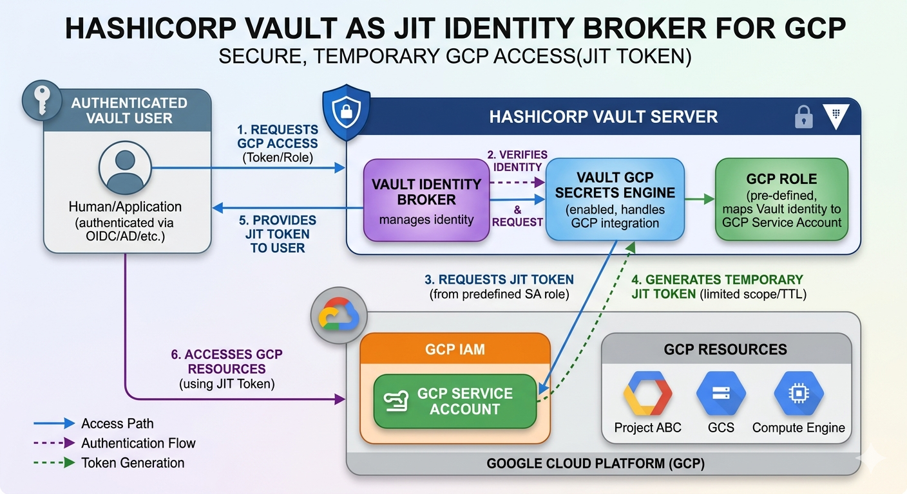
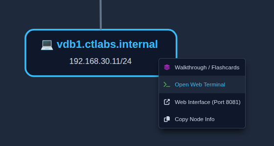
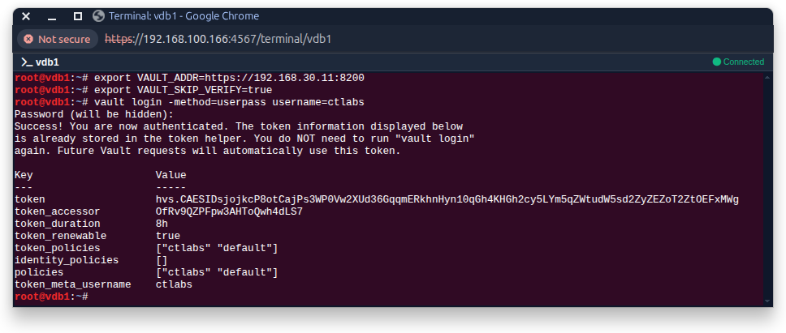
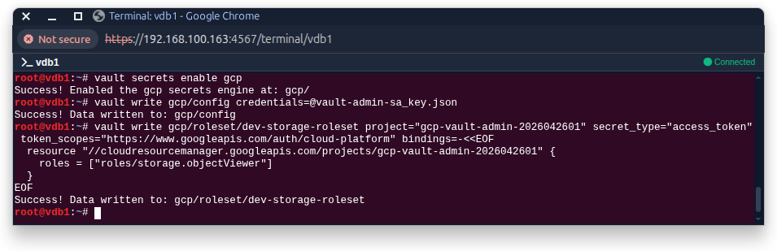
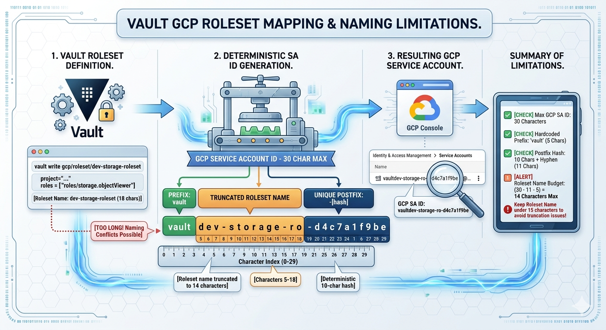
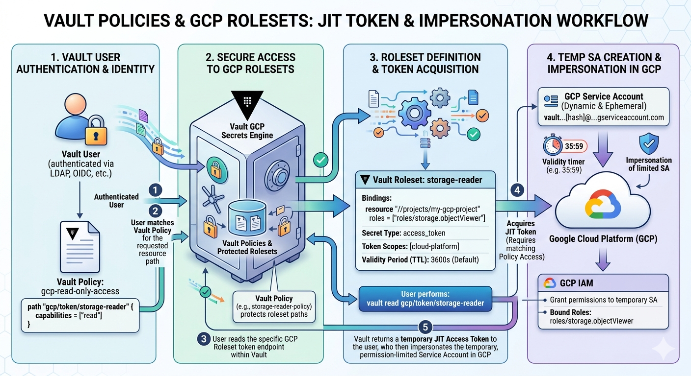

CTLABS - Automation
===================

Using hashicorp vault as Identity Broker
----------------------------------------

By leveraging HashiCorp Vault as our Identity Broker, we provide users with on-demand access to GCP via Just-In-Time (JIT) tokens.
These tokens are short-lived and cryptographically bound to specific IAM roles.
This approach eliminates the need for static service accounts and long-term IAM bindings within GCP. Instead, we define Vault Roles that encapsulate the necessary permissions, ensuring a more secure, ephemeral access model.



### Overview

The steps necessary to setup vault as identity broker for gcp access:

* **API Enablement**       : Activate GCP Service Usage, IAM, and Resource Manager APIs.
* **Administrative SA**    : Provision a "Manager" Service Account with permissions to manipulate IAM policies.
* **Engine Configuration** : Link Vault to GCP using the Manager SA credentials.
* **Roleset Definition**   : Create the mapping between Vault paths and GCP IAM roles.
* **Identity Mapping**     : Assign Vault policies to specific Identity Groups (LDAP/OIDC).
* **Token Generation**     : Users authenticate to Vault to receive temporary OAuth2 access tokens.

---

### GCP Service Account Setup

1.  **Dedicated Project**
      * Use a dedicated gcp project for Vault’s Administrative Service Account:

```bash
gcloud projects create gcp-vault-admin-2026042601 --name="CTLABS Vault Admin Project" --set-as-default
```

2.  **Required APIs**
      * Enable the required api's in the dedicated project:
        * `iam.googleapis.com`
        * `cloudresourcemanager.googleapis.com`
        * `iamcredentials.googleapis.com`

```bash
gcloud services enable iam.googleapis.com \
      cloudresourcemanager.googleapis.com \
            iamcredentials.googleapis.com \
    --project="gcp-vault-admin-2026042601"
```

3.  **Create the administrative service account `vault-admin-sa`**
      * Assign the following roles to the Service Account:
        * **Service Account Admin**     : `roles/iam.serviceAccountAdmin`
        * **Service Account Key Admin** : `roles/iam.serviceAccountKeyAdmin`
        * **Project IAM Admin**         : `roles/resourcemanager.projectIamAdmin`

```bash
gcloud iam service-accounts create vault-admin-sa   \
    --display-name="Vault GCP Secrets Engine Admin" \
    --project="gcp-vault-admin-2026042601"
```

```bash
SA_EMAIL="vault-admin-sa@gcp-vault-admin-2026042601.iam.gserviceaccount.com"
PROJECT_ID="gcp-vault-admin-2026042601"

for ROLE in "roles/iam.serviceAccountAdmin"    \
            "roles/iam.serviceAccountKeyAdmin" \
            "roles/resourcemanager.projectIamAdmin"; do 
    gcloud projects add-iam-policy-binding $PROJECT_ID --member="serviceAccount:$SA_EMAIL" --role="$ROLE";
done
```

```bash
gcloud iam service-accounts keys create vault-admin-sa_key.json
  --iam-account=$SA_EMAIL --project=$PROJECT_ID
```

Copy the keyfile `vault-admin-sa_key.json` to the host `vdb1.ctlabs.internal`. We will use in it the vault configuration.

---

### Vault Configuration

1. **Open a terminal on `vdb1.ctlabs.internal`**



2. **Login into vault via cli**
```bash
export VAULT_ADDR=https://192.168.30.11:8200
export VAULT_SKIP_VERIFY=true
vault login -method=userpass username=ctlabs
# Default ctlabs password: secret123!
```




3. **GCP Secrets Engine Setup**

Next we enable the `gcp secrets engine` in vault via cli:
```bash
# Enable the engine
vault secrets enable gcp

# Configure with the Admin SA Key
vault write gcp/config credentials=@vault-admin-sa_key.json
```

4. **Defining Rolesets**

Now we can define rolesets, i.e. the mappings between the vault user/group and the gcp permissions. E.g. let's define a roleset `dev-storage-roleset`
```bash
vault write gcp/roleset/dev-storage-roleset project="gcp-vault-admin-2026042601" \
  secret_type="access_token" token_scopes="https://www.googleapis.com/auth/cloud-platform" \
  bindings=-<<EOF
  resource "//cloudresourcemanager.googleapis.com/projects/gcp-vault-admin-2026042601" {
    roles = ["roles/storage.objectViewer"]
  }
EOF
```



> **INFO - GCP Roleset Lifecycle**
>
>Creating a `GCP Roleset` in Vault triggers the automated creation of a dedicated `Service Account (SA)` within the `target GCP project`. 
>
>This `SA` is assigned the `IAM bindings` defined in the roleset. When a user or application requests a `JIT` (Just-In-Time) Token, Vault generates a temporary `OAuth2` access token by impersonating this managed `Service Account`.

> ❗ **The 14-Character Limit**
> 
> Because Vault appends a unique hyphen and hash to the Service Account ID, the roleset name is strictly limited to **14 characters** to ensure the final GCP Service Account name does not exceed the 30-character provider limit. 

**Example Mapping:**

```bash
# The Vault Admin SA (The Bouncer)
gcloud iam service-accounts list
DISPLAY NAME: Vault GCP Secrets Engine Manager
EMAIL: vault-admin-sa@gcp-vault-admin-2026042601.iam.gserviceaccount.com
DISABLED: False

# The Roleset SA (Created by Vault)
DISPLAY NAME: Service account for Vault secrets backend role set role set dev-storage-roleset
EMAIL: vaultdev-storage-ro-1777226478@gcp-vault-admin-2026042601.iam.gserviceaccount.com
DISABLED: False
```


### Identity Broker (Policy) Setup
Let's setup the gcp permissions for the role

```hcl
# Define the access policy (gcp-access-policy.hcl)
path "gcp/token/dev-storage-roleset" {
    capabilities = ["read"]
}
```

```bash
# Create the internal Vault group for developers
vault write identity/group name="developer" \
    policies="gcp-access-policy" \
    type="internal"
```


### GCP Service Account Naming Conventions

When using the Vault GCP Secrets Engine in **Roleset** mode, Vault automatically manages the lifecycle of Service Accounts (SAs) in your GCP project. These accounts follow a strict naming convention to comply with Google Cloud's **30-character limit**.



#### Anatomy of a Vault-Managed Service Account
Vault constructs the Service Account ID using the following formula: `vault` + `[truncated_roleset_name]` + `-` + `[hash]`

| Component        | Length            | Description                                            |
|------------------|-------------------|--------------------------------------------------------|
| **Prefix**       | 5 Characters      | Hardcoded as `vault`. No hyphen is included.           |
| **Roleset Name** | **14 Characters** | The truncated Vault Roleset Name                       |
| **Separator**    | 1 Character       | A hyphen `-` added by Vault before the hash.           |
| **Hash**         | 10 Characters     | A deterministic CRC32 hash to prevent name collisions. |
| **Total**        | **30 Characters** | The maximum allowed by Google Cloud IAM.               |

* **The 14-Character Rule**: To prevent "ugly" truncation where the middle of a word is cut off, keep your Vault Roleset names to **14 characters or fewer**.
* **Identification**: All SAs managed by this system are easily searchable in the GCP Console by filtering for the `vault` prefix.
* **Lifecycle**: Do not manually delete these Service Accounts in the GCP Console. Always use `vault delete` on the roleset path to ensure Vault cleans up both the GCP identity and its internal metadata.

---


### User Workflow (Generating JIT)



1.  **Login**: User authenticates via their standard method.
    ```bash
    vault login -method=userpass username=ctlabs
    ```

2.  **Request Access**: User requests the ephemeral GCP token.
    ```bash
    vault read gcp/token/dev-storage-roleset
    ```

3.  **Consumption**: The returned token can be used immediately with `gcloud` or other SDKs.
    ```bash
    gcloud storage ls --access-token-file=<(echo $TOKEN)
    ```
