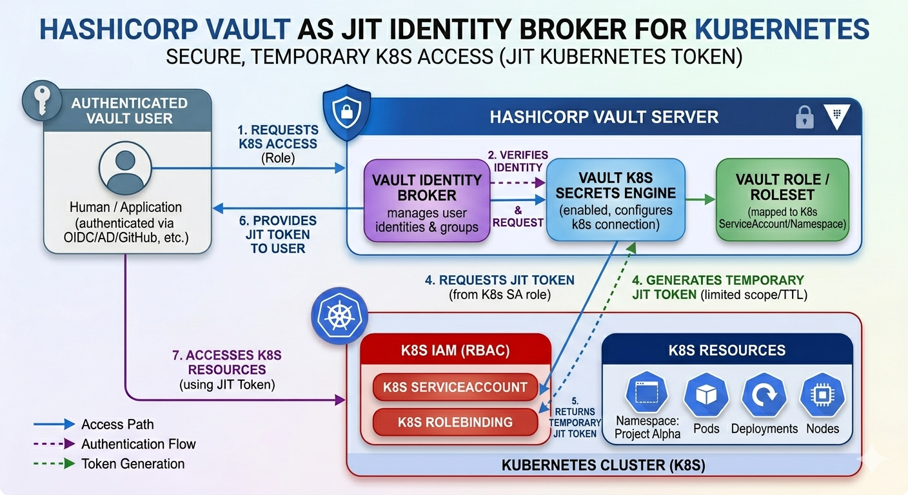

CTLABS - Automation
===================

Using hashicorp vault as identity broker
----------------------------------------

### Kubernetes Secrets Engine




### K8s

# Setting up HashiCorp Vault as a JIT Identity Broker for Kubernetes

This guide outlines the steps to configure HashiCorp Vault to act as an identity broker between an external authentication provider (like OIDC, AD, or GitHub) and a Kubernetes cluster, providing Just-In-Time (JIT) credentials.


## Phase 1: Kubernetes Cluster Preparation

Vault needs a "manager" identity within Kubernetes to create service accounts and tokens on behalf of users.

1. **Create a Service Account for Vault**:
   ```bash
   kubectl create serviceaccount vault-admin -n vault
   ```
2. **Grant Permissions**:
   Assign the `system:auth-delegator` role and necessary RBAC permissions so Vault can manage tokens and ServiceAccounts.
   ```yaml
   apiVersion: rbac.authorization.k8s.io/v1
   kind: ClusterRoleBinding
   metadata:
     name: vault-admin-binding
   roleRef:
     apiGroup: rbac.authorization.k8s.io
     kind: ClusterRole
     name: cluster-admin # Or a scoped role with serviceaccount/token create permissions
   subjects:
   - kind: ServiceAccount
     name: vault-admin
     namespace: vault
   ```

---

## Phase 2: Enable the Kubernetes Secrets Engine

Login to Vault and enable the engine that will interface with the K8s API.

1. **Enable the Engine**:
   ```bash
   vault secrets enable kubernetes
   ```
2. **Configure the Connection**:
   Vault needs to know how to talk to the K8s API.
   ```bash
   vault write kubernetes/config \
       kubernetes_host="https://<K8S_API_ENDPOINT>:6443" \
       kubernetes_ca_cert=@ca.crt \
       token_reviewer_jwt="<JWT_OF_VAULT_ADMIN_SA>"
   ```

---

## Phase 3: Create a Dynamic Role (The JIT Definition)

A role in the K8s secrets engine maps a Vault policy to a set of K8s permissions.

```bash
vault write kubernetes/roles/developer-role \
    allowed_kubernetes_namespaces="project-alpha" \
    token_default_ttl="2h" \
    generated_role_rules='{
        "rules": [
            {
                "apiGroups": [""],
                "resources": ["pods", "services", "configmaps"],
                "verbs": ["get", "list", "watch", "create"]
            }
        ]
    }'
```

---

## Phase 4: Configure the Identity Brokerage

This is the step that connects your **Authenticated User** (from OIDC/LDAP) to the **Kubernetes Role**.

1. **Define a Vault Policy**:
   ```hcl
   # Name: k8s-jit-access
   path "kubernetes/creds/developer-role" {
     capabilities = ["read"]
   }
   ```
2. **Assign to Identity Groups**:
   In Vault's Identity engine, create an internal group (e.g., `engineering-team`) and attach the `k8s-jit-access` policy. Map your external OIDC/LDAP groups to this Vault group using **Group Aliases**.

---

## Phase 5: End-User Workflow

Once the brokerage is set up, the user flow is fully automated:

1. **Auth**: User authenticates to Vault using their corporate credentials.
2. **Request**: User requests a K8s token:
   ```bash
   vault read kubernetes/creds/developer-role
   ```
3. **Delivery**: Vault communicates with the K8s API, creates a transient ServiceAccount, generates a token with a 2-hour TTL, and returns it to the user.
4. **Access**: The user uses this token with `kubectl` or their application to access the `project-alpha` namespace.